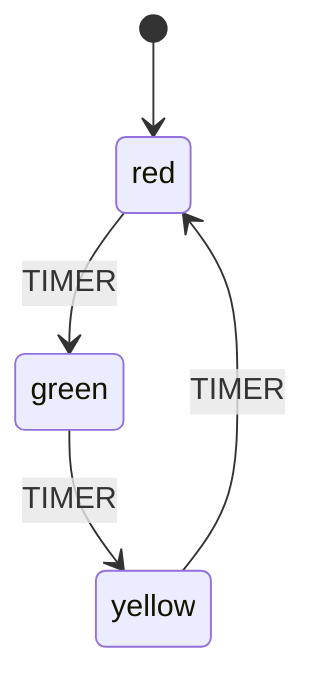
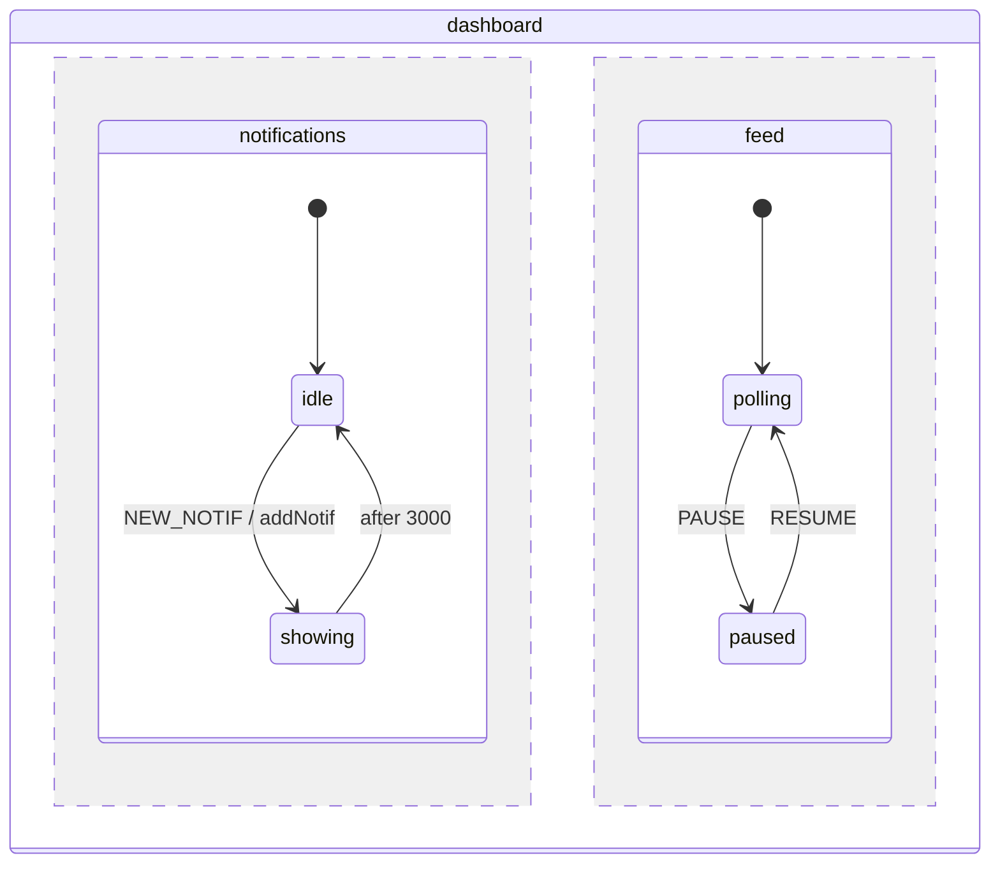

# xstate-mermaid

> Standard [Mermaid stateDiagram-v2](https://mermaid.js.org/syntax/stateDiagram.html) as the source format for [XState v5](https://stately.ai/docs/xstate) state machines. Designed for LLM agents. ~4x compression vs JSON/TS config with zero semantic loss.

## Why

XState v5 configs are verbose JSON/TypeScript — expensive in LLM context tokens and slow to generate. This tool solves three problems:

1. **Faster generation** — an LLM agent outputs ~4x fewer tokens to describe the same state machine, which directly speeds up generation
2. **Cheaper to read** — `.md` files with `mermaid` code blocks in the repo are compact and unambiguous, so agents parse the full machine logic in a fraction of the context window
3. **State machine as spec** — an `.md` file can serve as a living specification for your SDLC: define workflows, hand them to agents for implementation, then **validate** the spec is correct

The input is **standard Mermaid stateDiagram-v2** — it renders as a diagram in GitHub, GitLab, and any Mermaid tool. XState extensions (entry/exit, invoke, context) live in `%%` comments that Mermaid ignores but our parser reads.



## Features

- **Mermaid → XState v5 JSON** — standard stateDiagram-v2 input, production-ready XState output
- **XState v5 JSON → Mermaid** — convert existing machines to renderable diagrams
- **Roundtrip verification** — `Mermaid → JSON → Mermaid` to prove losslessness
- **Validation** — static analysis + XState v5 runtime validation (createMachine + createActor)
- **Scenario testing** — run event traces against your spec and verify expected states
- **Full XState v5 coverage** — parallel states, invocations, guards, actions, history, nested hierarchies
- **Renders everywhere** — GitHub, GitLab, VS Code, any Mermaid tool
- **Python API** — `parse()`, `to_xstate()`, `to_mermaid()`, `validate_static()` for programmatic use

## Installation

```bash
# One-liner via uvx (no install needed)
uvx --from "git+https://github.com/vgmakeev/xstate-mermaid.git" xstate-dsl mermaid2xstate machine.md

# Or install globally
uv tool install "git+https://github.com/vgmakeev/xstate-mermaid.git"

# For runtime validation, install xstate in the package's bundled runtime:
npm install --prefix "$(python3 -c 'import xstate_dsl; import os; print(os.path.join(os.path.dirname(xstate_dsl.__file__), "_runtime"))')"
```

## Usage

### CLI

```bash
# Mermaid → XState v5 JSON
xstate-dsl mermaid2xstate machine.md

# XState v5 JSON → Mermaid
xstate-dsl xstate2mermaid machine.json

# Roundtrip verification
xstate-dsl roundtrip machine.md

# Validate (static + runtime)
xstate-dsl validate machine.md

# Validate with scenario testing
xstate-dsl validate machine.md --scenarios tests.json

# Static only (no Node.js needed)
xstate-dsl validate machine.md --static-only

# JSON output for CI
xstate-dsl validate machine.md --format json

# Treat warnings as errors
xstate-dsl validate machine.md --strict

# Pipe from stdin
cat machine.md | xstate-dsl mermaid2xstate - -o output.json
```

### Validate

The `validate` command runs three levels of checks:

**1. Static analysis** (Python, always runs):
- Empty machine detection
- Missing initial states in compound states
- Unreachable states (BFS from initial)
- Final states with outgoing transitions

**2. Runtime validation** (Node.js + XState v5, if available):
- `createMachine()` succeeds with your config
- `createActor().start()` produces a valid initial state
- Reports any XState errors

**3. Scenario testing** (`--scenarios file.json`):

```json
{
  "initial": "idle",
  "steps": [
    { "send": "SUBMIT", "expect": "validating" },
    { "send": "APPROVE", "expect": "confirmed" }
  ]
}
```

Example output:

```
Validating: orderflow.md

Static Analysis
  OK     No issues found

Runtime Validation (XState v5)
  OK     createMachine() + createActor() succeeded — initial state: "idle"

Scenarios (2/2 passed)
  [1]  send SUBMIT            → expected "validating" → got "validating"  PASS
  [2]  send APPROVE           → expected "confirmed"  → got "confirmed"   PASS

Result: all checks passed
```

### Python API

```python
from xstate_dsl import parse, to_xstate, to_mermaid, validate_static

machine = parse(mermaid_text)           # Mermaid text → AST
config  = to_xstate(machine)            # AST → XState v5 config dict
mermaid = to_mermaid(xstate_config)     # XState v5 config → Mermaid text
issues  = validate_static(machine)      # Static analysis → list of issues
```

## Syntax

Standard [Mermaid stateDiagram-v2](https://mermaid.js.org/syntax/stateDiagram.html) with XState extensions in `%%` comments.

### Quick Reference

```mermaid
stateDiagram-v2
    %% machine: myMachine
    %% context: { count: 0 }

    [*] --> idle
    idle --> loading : FETCH [isAuthed] / setLoading
    loading --> success : done / assignData
    loading --> error : error / assignError
    loading --> idle : after 10000
    success --> [*]

    state loading {
        %% invoke: fetchData [id: fetcher, input: { url: context.url }]
    }

    state success {
        %% type: final
        %% entry: notifyDone
    }
```

### XState Extensions in `%%` Comments

**Machine level** (top of diagram):
```
%% machine: <id>
%% version: <semver>
%% context: { key: value, ... }
%% input: { key: type, ... }
%% output: { key: type, ... }
%% on *: [guard] / action -> target
```

**State level** (inside `state name { }`):
```
%% entry: action1, action2
%% exit: action1
%% invoke: serviceName [id: x, input: {...}]
%% type: final | parallel | history | history.deep
%% tags: a, b
%% description: "text"
%% target: defaultState          (for history states)
```

### Transition Labels

```
source --> target : EVENT [guard] / action
source --> target : always [guard] / action
source --> target : after 3000 [guard] / action
source --> target : done [guard] / action
source --> target : error [guard] / action
source --> target : done.state
source --> source : EVENT / action @reenter
```

<details>
<summary><strong>Guards</strong></summary>

```
[name]                  # simple reference
[!name]                 # negation
[a, b]                  # AND
[a | b]                 # OR
[name(key: val)]        # parameterized
[else]                  # fallback (no guard)
```

</details>

<details>
<summary><strong>Actions</strong></summary>

```
/ name                  # reference
/ assign({...})         # inline assign
/ raise(EVENT)          # raise event
/ sendTo(ref, {...})    # send to actor
/ sendParent({...})     # send to parent
/ emit({...})           # emit to subscribers
/ spawn(machine, {...}) # spawn child actor
/ stop(ref)             # stop actor
/ log("msg")            # log
/ forwardTo(ref)        # forward event
```

</details>

<details>
<summary><strong>Parallel states</strong></summary>



</details>

### Example: Order Flow

See [`orderflow.md`](orderflow.md) for a complete example with parallel processing, invocations, guards, and error handling.

## Compression Ratio

| Scenario | XState TS | Mermaid | Ratio |
|----------|-----------|---------|-------|
| Simple machine (3 states) | ~40 lines | ~10 lines | **4x** |
| Parallel + invoke | ~120 lines | ~35 lines | **3.4x** |
| Full order flow | ~300 lines | ~80 lines | **3.7x** |
| Setup + types boilerplate | ~50 lines | 2 lines | **25x** |

## Tests

```bash
# Python tests (82 converter + 15 validator)
uv run --extra dev pytest

# XState v5 runtime tests (47 tests)
cd test_xstate_runtime && node test_machines.mjs
```

## Project Structure

```
xstate_dsl/
  __init__.py       # Public API: parse, to_xstate, to_mermaid, validate_static
  __main__.py       # CLI entry point (mermaid2xstate, xstate2mermaid, roundtrip, validate)
  models.py         # AST data classes
  parser.py         # Mermaid stateDiagram-v2 → AST
  to_xstate.py      # AST → XState v5 JSON
  to_mermaid.py     # XState v5 JSON → Mermaid stateDiagram-v2
  validate.py       # Static analysis (orphan/unreachable states, missing targets)
  runtime.py        # XState v5 runtime validation via Node.js subprocess
  _runtime/         # Bundled Node.js scripts + xstate dependency
```

## License

MIT
